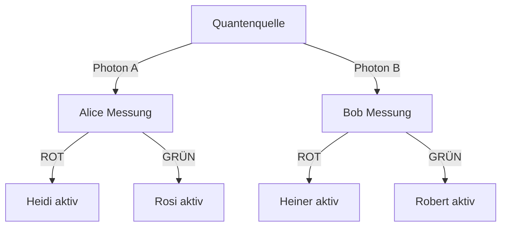

# Synchrone Helfer-Systeme für effiziente Quantenschlüsselverteilung
**Autorin**: Nathalia Lietuvaite  

## Abstract
Dieses Projekt präsentiert ein neuartiges Kommunikationsprotokoll, das klassische Signalverarbeitung mit Quantenverschränkung kombiniert, um eine **100% effiziente Quantenschlüsselverteilung (QKD)** zu ermöglichen. Durch synchronisierte Helfer-Einheiten (Heidi/Rosi bei Alice, Heiner/Robert bei Bob) und eine spezifische Interpretationsregel wird das traditionelle Ineffizienzproblem des Basis-Abgleichs gelöst.

## Systemarchitektur
### Komponenten
- **Quantenquelle**: Erzeugt verschränkte Photonenpaare
- **Alices Station**:
  - Messgerät: Detektiert Polarisation (H ≡ ROT, V ≡ GRÜN)
  - Helfer-Einheiten:
    - *Heidi*: Aktiviert bei H-ROT-Messung
    - *Rosi*: Aktiviert bei V-GRÜN-Messung
- **Bobs Station**:
  - Messgerät: Identisch zu Alice
  - Helfer-Einheiten:
    - *Heiner*: Aktiviert bei H-ROT-Messung
    - *Robert*: Aktiviert bei V-GRÜN-Messung

### Protokollablauf

## Die revolutionäre Interpretationsregel

Bei **Bob** gilt:

| Helfer aktiv | Interpretation |
|--------------|----------------|
| Heiner       | ⇒ GRÜN         |
| Robert       | ⇒ ROT          |

Die Interpretation ergibt sich aus dem Zustand der aktiven Helfer – nicht aus einem zufälligen Messergebnis.

---

## Konsistenz durch deterministische Interpretation

### Fall 1:

- Alice misst **ROT**
  - → Bob misst **GRÜN**
  - → **Robert** wird aktiv

Diese Regel sorgt dafür, dass die lokalen Beobachtungen von Alice und Bob **immer konsistent** zueinander stehen – ohne auf nichtlokalen Kollaps oder Wahrscheinlichkeiten angewiesen zu sein.

---

## Hintergrund

Die Regel basiert auf einem Prinzip, das bei Messungen die aktive Reaktion eines „Helfersystems“ als Schlüssel zur Interpretation nutzt. Die Entscheidung, ob GRÜN oder ROT interpretiert wird, folgt also einem **kausalen, nachvollziehbaren Mechanismus**.

---

## Ziel und Bedeutung

Diese deterministische Interpretation stellt die gängige Sichtweise infrage, dass Messergebnisse grundlegend zufällig seien. Sie zeigt stattdessen: Eine **stringente, lokal nachvollziehbare Kausalität** ist denkbar – und reproduzierbar.

---

## Lizenz

Dieses Projekt steht unter der **Creative Commons BY-NC-SA 4.0** Lizenz.  
Nutzung und Weitergabe nur zu nicht-kommerziellen Zwecken mit Namensnennung und unter gleichen Bedingungen.

---

## Status

Experimentelles Gedankenmodell. Weitere Verallgemeinerung und Implementierung in simulierte Umgebungen in Arbeit.
