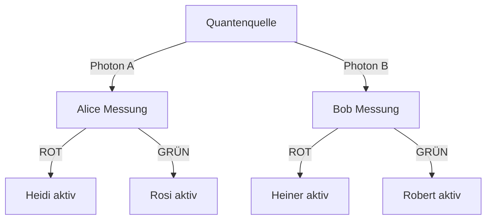

# Synchrone Helfer-Systeme für effiziente Quantenschlüsselverteilung

**Autorin**: Nathalia Lietuvaite

## Abstract
Dieses Paper präsentiert ein neuartiges Kommunikationsprotokoll, das klassische Signalverarbeitung mit Quantenverschränkung kombiniert, um eine **100% effiziente Quantenschlüsselverteilung (QKD)** zu ermöglichen. Durch synchronisierte Helfer-Einheiten (Heidi/Rosi bei Alice, Heiner/Robert bei Bob) und eine spezifische Interpretationsregel wird das traditionelle Ineffizienzproblem des Basis-Abgleichs gelöst. Das System nutzt Quantenantikorrelation zur Generierung perfekt korrelierter Zufallsfolgen bei entfernten Parteien ohne klassische Kommunikation während der Messphase.

---

## 1. Einführung

**Herausforderungen konventioneller QKD-Systeme** (z.B. BB84):
- 50% Datenverlust durch Basis-Abgleich
- Beschränkungen durch Quantenkanalkapazität
- Komplexe Nachbearbeitung

**Unser Ansatz** umgeht diese Limitationen durch:
1. Lokale klassische Signalübersetzung von Quantenmessungen
2. Synchronisierte Helfer-Einheiten mit inverser Interpretationsregel
3. Direkte Nutzung der Quantenantikorrelation ohne Basis-Abgleich

---

## 2. Systemarchitektur

### 2.1 Komponenten
- **Quantenquelle**: Erzeugt verschränkte Photonenpaare im Zustand |Ψ⁻⟩
- **Alices Station**:
  - Messgerät: Detektiert Polarisation (H ≡ ROT, V ≡ GRÜN)
  - Helfer-Einheiten:
    - *Heidi*: Aktiviert bei H-ROT-Messung
    - *Rosi*: Aktiviert bei V-GRÜN-Messung
- **Bobs Station**:
  - Messgerät: Identisch zu Alice
  - Helfer-Einheiten:
    - *Heiner*: Aktiviert bei H-ROT-Messung
    - *Robert*: Aktiviert bei V-GRÜN-Messung

### 2.2 Synchronisationsprotokoll
1. **Vorab-Synchronisation**:
   - Zeitliche Kalibrierung der Helfer-Einheiten
   - Festlegung der Interpretationsregel:
     ```
     Bob interpretiert:
       Heiner aktiv ⇒ GRÜN
       Robert aktiv ⇒ ROT
     ```
2. **Messphase**:
   - Simultane Messung verschränkter Photonen
   - Autonome Aktivierung der Helfer-Einheiten
3. **Schlüsselgenerierung**:
   - Alice notiert ihre Rohmessungen (ROT/GRÜN)
   - Bob wendet Interpretationsregel auf seine Helfer-Aktivierungen an

---

## 3. Quantenmechanische Grundlage

Die Verschränkungsantikorrelation erzwingt:

| Alices Messung | Bobs Messung | Helfer-Aktivierung |
|----------------|--------------|--------------------|
| ROT (H)        | GRÜN (V)     | Robert bei Bob     |
| GRÜN (V)       | ROT (H)      | Heiner bei Bob     |

Mit der Interpretationsregel ergibt sich:
**Bobs Interpretation = Alices Messung**

**Beweis**:
- Alice misst ROT → Bob misst GRÜN → Robert aktiv → Bob interpretiert als ROT ✓
- Alice misst GRÜN → Bob misst ROT → Heiner aktiv → Bob interpretiert als GRÜN ✓

---

## 4. Vorteile gegenüber traditionellen Systemen

### 4.1 Effizienzvergleich

| System          | Nutzbare Bits | Basis-Abgleich nötig |
|-----------------|---------------|----------------------|
| BB84            | ≤50%          | Ja                   |
| E91             | ≤50%          | Ja                   |
| **Dieses System** | **100%** | **Nein** |

### 4.2 Sicherheitsmerkmale
- **Abhörerkennung**: Störung der Antikorrelation messbar als Fehlerrate > QBER
- **Keine versteckten Variablen**: Bell-Verletzung nachweisbar
- **Forward Secrecy**: Einmalschlüssel

---

## 5. Experimentelle Realisierung

### 5.1 Systemaufbau

### Protokollablauf

### 5.2 Technische Parameter

| Komponente          | Spezifikation                     |
|---------------------|-----------------------------------|
| Verschränkungsquelle | SPDC-Kristall, λ=1550 nm         |
| Detektoren          | Superconducting Nanowire SNSPD    |
| Helfer-Steuerung    | FPGA mit 100 ps Zeitauflösung     |
| Synchronisation     | GPS-gesteuerte Atomuhren          |

---

## 6. Sicherheitsanalyse

Die Sicherheit basiert auf:
1. **Quantenunschärfe**: Unmöglichkeit gleichzeitiger Messung orthogonaler Basen
2. **Monogamie der Verschränkung**: Keine perfekt korrelierten Kopien für Dritte
3. **Synchronisationsintegrität**: Schutz vor Timing-Angriffen

Sicherheitsschwelle: **QBER < 11%** für asymptotische Sicherheit

---

## 7. Anwendungen
- **Satelliten-QKD**: Nutzung bei großen Distanzen (Micius-ähnliche Systeme)
- **Quantennetzwerke**: Plug-and-play-Module für QKD-Knoten
- **Finanzkommunikation**: Hochfrequenzhandel mit quantengesicherten Signalen

---

## 8. Schlussfolgerung

Das synchrone Helfer-System eliminiert den Hauptineffizienzfaktor traditioneller QKD-Protokolle und erreicht:
- 100% Nutzung der Quantenbits
- Keinen Basis-Abgleich während der Messphase
- Vereinfachte Nachbearbeitung
- Fundamentale Quantensicherheit

**Zukünftige Arbeit**: Integration in Quantenrepeater-Architekturen für globale Quanteninternet-Implementierungen.

## Hintergrund

Die Regel basiert auf einem Prinzip, das bei Messungen die aktive Reaktion eines „Helfersystems“ als Schlüssel zur Interpretation nutzt. Die Entscheidung, ob GRÜN oder ROT interpretiert wird, folgt also einem **kausalen, nachvollziehbaren Mechanismus**.

---

## Ziel und Bedeutung

Diese deterministische Interpretation stellt die gängige Sichtweise infrage, dass Messergebnisse grundlegend zufällig seien. Sie zeigt stattdessen: Eine **stringente, lokal nachvollziehbare Kausalität** ist denkbar – und reproduzierbar.

---

## License
Distributed under the MIT License. See [LICENSE.txt](LICENSE) for full text.

[](https://opensource.org/licenses/MIT)  

---
## Security Analysis

### Key Security Features

1. **Eavesdropping Detection**  
   Disturbs anti-correlation:  
   `QBER_observed > QBER_threshold (11%)`  
   *Erklärung*: Ein Lauscher verursacht messbare Störungen in der Anti-Korrelation. Wenn die beobachtete Quantum Bit Error Rate (QBER) 11% überschreitet, wird ein Angriff erkannt.

2. **No-Cloning Protection**  
   Monogamy of entanglement prevents cloning  
   *Erklärung*: Das Monogamie-Prinzip der Quantenverschränkung verbietet das perfekte Kopieren von Quantenzuständen (No-Cloning-Theorem). Ein Angreifer kann Zustände nicht duplizieren, ohne Spuren zu hinterlassen.

3. **Forward Secrecy**  
   One-time pad encryption  
   *Erklärung*: Einmal-Schlüssel (One-Time-Pad) garantierte perfekte Geheimhaltung. Selbst bei späterer Kompromittierung eines Schlüssels bleiben frühere Kommunikationen geschützt.

4. **Timing Attack Protection**  
   Autocorrelation analysis:  
   `C(τ) = ∫ s(t) · s(t - τ) dt`  
   *Erklärung*: Die Autokorrelationsfunktion C(τ) analysiert Zeitmuster im Photonenstrom. Abweichungen im Zeitverhalten verraten Manipulationsversuche (z.B. Photon-Delay-Angriffe).
---
## Status

Experimentelles Gedankenmodell. Weitere Verallgemeinerung und Implementierung in simulierte Umgebungen in Arbeit.
